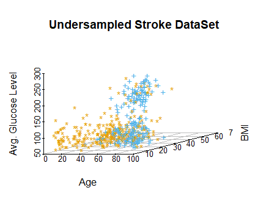
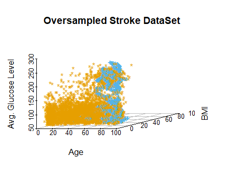
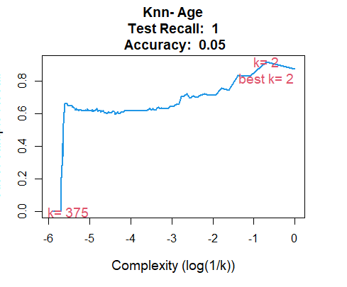
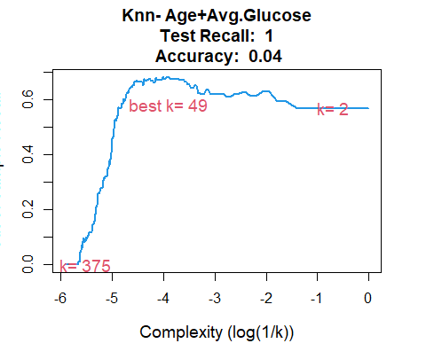
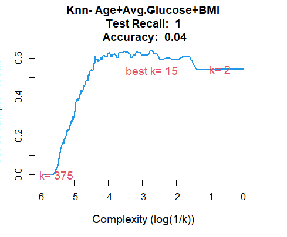

# Exercise 2.10:

```{r 2.10.setup, warning=FALSE, message=FALSE, echo=FALSE}
knitr::opts_chunk$set(echo = FALSE)
knitr::opts_chunk$set(warning = FALSE)
knitr::opts_chunk$set(message = FALSE)

knitr::opts_chunk$set(set.seed(7))

rm(list = ls())
require(MASS)
attach(Boston)
```

## _2.10.a_

```{r 2.10.a.1}
cat("Number of rows in the Boston DataSet   :",paste(nrow(Boston)),"\n")
cat("Number of columns in the Boston DataSet:",paste(ncol(Boston)),"\n")
```
A rows represent observations for each town

The columns represent the following features:

- _**crim   : **_ per capita crime rate by town.
- _**zn     :**_ proportion of residential land zoned for lots over 25,000 sq.ft.
- _**indus  :**_ proportion of non-retail business acres per town.
- _**chas   :**_ Charles River dummy variable (= 1 if tract bounds river; 0 otherwise).
- _**nox    :**_ nitrogen oxides concentration (parts per 10 million).
- _**rm     :**_ average number of rooms per dwelling.
- _**age    :**_ proportion of owner-occupied units built prior to 1940.
- _**dis    :**_ weighted mean of distances to five Boston employment centres.
- _**rad    :**_ index of accessibility to radial highways.
- _**tax    :**_ full-value property-tax rate per \$10,000.
- _**ptratio:**_ pupil-teacher ratio by town.
- _**black  :**_ 1000(Bk - 0.63)^2 where Bk is the proportion of blacks by town.
- _**lstat  :**_ lower status of the population (percent).
- _**medv   :**_ median value of owner-occupied homes in \$1000s.
```{r 2.10.a.2}
str(Boston)
```

## _2.10.b_
```{r 2.10.b, fig.align='center', fig.height = 5, fig.width = 7}
pairs(Boston[,c("age","crim","lstat","rm","medv")])
```
_**Inference:**_

- *lstat* is negatively corelated with *medv*
- *lstat* is negatively corelated with *rm*
- very low *medv* usually has higher *crime rate*. But largely, *crime rate* is independent of *locality/medv*
- *lstat* independent of *crime rate*
- *rm* (#Rooms) positively corelated to *medv*
- relationship between *crime rate per capita* and other variables is *non-linear*

## _2.10.c_
```{r 2.10.c, fig.align='center', fig.height = 5, fig.width = 5}
for(col in colnames(Boston[,-1])){
  plot(crim, xlab = "Crime Rate",
       Boston[,col], ylab = paste(col),
       main = paste("Per Caprita Crime Rate v/s",col))
}
```
_**Inference:**_

- There exists some correlations for *per capita crime rate* with each variable, except *chas*
- *crime rate* seem to spike within certain zones
    * when *rad* is > 20
    * when *tax* is between 600 and 700
    * when *zn* is close to 0
    * when *nox* is between 0.6 and 0.8
- negative correlations with *dis*, *medv* and maybe *black*

## _2.10.d_

```{r 2.10.d, fig.align='center', fig.height = 5, fig.width = 5}

for(col in colnames(Boston[,c("ptratio","crim","tax")])){
  plot(Boston[,col], xlab = "Frequency", ylab = col)
}
```
_**Inference**_

- There exists definite outliers for *crim* and *tax*
- There are no clear outliers for *ptratio*

## _2.10.e_
```{r 2.10.e}
cat("Number of Towns bound by the Clares river:",paste(sum(chas==1)))  # 35 towns
```
## _2.10.f_
```{r 2.10.f}
cat("Median Pupil-Teacher Ratio:",paste(median(ptratio)))  # 35 towns
```
## _2.10.g_
```{r 2.10.g}
# there are two towns with lowest medv value of 5
(seltown <- Boston[Boston$medv == min(Boston$medv),])
# overall quartiles and range of predictors
sapply(Boston, quantile)
```
How the predictors for the minimum *Median Value* compare against the rest:

- *age*, *rad* at max
- *crim*, *indus*, *nox*, *tax*, *ptratio*, *lstat* at or above 75th percentile
- lowest for *zn*, *rm*, *dis*

## _2.10.h_
```{r 2.10.h}
# count of towns
cat("suburbs average >7 rooms per dwelling:",paste(nrow(Boston[Boston$rm > 7,])),"\n")
cat("suburbs average >8 rooms per dwelling:",paste(nrow(Boston[Boston$rm > 8,])),"\n\n")

cat("Stats regarding Dwellings with more than 8 bedrooms:\n")
sapply(Boston[Boston$rm > 8,], summary)
```

* *crime rates* are higher _(in the 50-75%ile: )_
* higher proportion of 25K sq ft lots
* much lower *lstat* value
* higher *medv* value

***
<a id="2.10"></a>

# EXERCISE 3.15:

```{r 3.15.setup, warning=FALSE, message=FALSE, echo=FALSE}
knitr::opts_chunk$set(echo = FALSE)
knitr::opts_chunk$set(warning = FALSE)
knitr::opts_chunk$set(message = FALSE)

knitr::opts_chunk$set(set.seed(7))

rm(list = ls())
require(MASS)
require(corrplot)
attach(Boston)
```

## _3.15.a_

```{r 3.15.a, fig.align='center', fig.height = 5, fig.width = 5}
mat <- matrix(0,length(colnames(Boston[,-1])),3)
i <- 0

significant <- NULL

for(cols in colnames(Boston[,-1]))
{
  i <- i+1
  cor(crim,Boston[cols])
  cat("\n")
  mdl <- lm(paste("crim~",cols), data = Boston)
  
  smry <- summary(mdl)
  coeff <- as.numeric(smry$coefficients[2,]["Estimate"])
  pval <- as.numeric(smry$coefficients[2,]["Pr(>|t|)"])
  rsqval <- as.numeric(smry$r.squared)
  
  plot(unlist(Boston[cols]),crim,pch=19,cex=1.5,xlab="Crime Rate",ylab = cols)
  abline(smry$coefficients[1,]["Estimate"],
         smry$coefficients[2,]["Estimate"],col=2,lwd=2)
  
  mat[i,1] <- coeff
  mat[i,2] <- pval
  mat[i,3] <- rsqval
  
  cat("For Predictor :",paste(cols),
      "\nCo-efficient:",paste(coeff),
      "\nP-value     :",paste(pval),
      "\nR^2         :",paste(rsqval),
      "\n")
  if(pval <= 0.05)
  {
    significant <- c(significant,cols)
  }
}

cat("\nStatistically Significant Variable are:\n",
    paste(significant),
    "\nbecause the P value for these are less than 0.05")
```

## 3.15.b
```{r 3.15.b}
mdl <- lm(crim~., data=Boston)
smry <- summary(mdl)

# Rejecting Coefficient = 0 hypothesis if p-value < 0.05
# This means Parameter is Significant
coeffs <- smry$coefficients[-1,4][smry$coefficients[-1,4] <0.05]

cat("Failing to reject NULL Hypothesis for: ")
for(x in colnames(t(coeffs))){
  cat(paste(x),"(",paste(coeffs[x]),")\n")
}
cat("Because Their P-Value is < 0.05")
```
## 3.15.c----
```{r 3.15.c, fig.align='center', fig.height = 5, fig.width = 5}
plot(x = mat[,1], xlab = "Simple Linear Regression Coefficients",
     y = smry$coefficients[-1,1], ylab = "Multiple Linear Regression Coefficients",
     main = "Parameter Coefficents Simple v/s Multiple"
)
```
## _3.15.d_
```{r 3.15.d}
mat <- matrix(0,length(colnames(Boston[,-1])),3)
mat <- as.data.frame(mat)
colnames(mat) <- c("^1","^2","^3")
row.names(mat) <- colnames(Boston[,-1])
i <- 0

significant <- NULL

for(cols in colnames(Boston[,-1]))
{
  i <- i+1
  cor(crim,Boston[cols])
  # cat("\n")
  mdl <- lm(paste("crim~",cols,"+I(",cols,"^2)+I(",cols,"^3)"), data = Boston)
  
  smry <- summary(mdl)
  for(j in 1:3){
    mat[i,] <- t(smry$coefficients[-1,4])
  }
  # plot(unlist(Boston[cols]),crim,pch=19,cex=1.5,xlab="Crime Rate",ylab = cols)
  # lines(sort(crim), fitted(mdl)[order(crim)], col='red', type='l') 
}

mat
```

***
<a id="3.15"></a>

# EXERCISE 4.10:

```{r 4.10.setup, include=FALSE}
knitr::opts_chunk$set(echo = FALSE)
knitr::opts_chunk$set(warning = FALSE)
knitr::opts_chunk$set(message = FALSE)

knitr::opts_chunk$set(set.seed(1))

rm(list = ls())
require(ISLR)
attach(Weekly)
require(caret)
require(class)
```

## _4.10.a_

```{r 4.10.a}
summary(Weekly)
pairs(Weekly[,-9])
```

Positive Correlation between `Year` and `Volume` observed.

## _4.10.b_

```{r 4.10.b}
mdl <- glm(Direction~., data=Weekly[,c(2:7,9)], family=binomial)
summary(mdl)
```

To check if a parameter is significant or not, we must check for its __P-Vaue__.

From the Summary, only `Lag2` has a __P-Value__ < 0.05.
Thus, only `Lag2` is statistically significant.

## _4.10.c_

```{r 4.10.c}
preds <- as.factor(ifelse(mdl$fitted > 0.5, "Up", "Down"))
cm <- confusionMatrix(preds, Direction, positive = "Up")
cm$table
cat("Accuracy            : ",paste(round(cm$overall["Accuracy"], digits = 4)*100),"%")
cat("Recall/Sensitivity  : ",paste(round(cm$byClass["Recall"], digits = 4)*100),"%")
cat("Precision           : ",paste(round(cm$byClass["Precision"], digits = 4)*100),"%")
cat("Specificity         : ",paste(round(cm$byClass["Specificity"], digits = 4)*100),"%")
cat("Up Prediction Rate  : ",paste(round(cm$byClass["Pos Pred Value"], digits = 4)*100),"%")
cat("Down Prediction Rate: ",paste(round(cm$byClass["Neg Pred Value"], digits = 4)*100),"%")
```
48 _"Up"_ were mistaken for _"Down"_.
430 _"Down"_ were mistaken for _"Up"_.
54 _"Down"_+ 557 _"Up"_ were predicted accurately .
Model is has higher accuracy when the prediction is _"Up"_

These results were obtained from the same set of observations the model was trained upon.
Therefore, it is highly likely that the results would prove to be _overly optimistic_ 
when tested on a new set of data.

## _4.10.d_

```{r 4.10.d}
filtered_years <- Weekly$Year %in% (1990:2008)
train <- Weekly[filtered_years,]
test <- Weekly[!filtered_years,]
mdl <- glm(Direction~Lag2, data=train, family=binomial)
preds <- predict(mdl, test, type="response")
preds <- as.factor(ifelse(preds > 0.5, "Up", "Down"))
cm <- confusionMatrix(preds, Direction[!filtered_years], positive = "Up")
cm$table
cat("[Logistic Regression] Overall Fraction of Correct Predictions (Accuracy) : ",
    paste(round(cm$overall["Accuracy"], digits = 2)))
```

## _4.10.g_

```{r 4.10.g}
preds <- knn(as.matrix(train$Lag2), as.matrix(test$Lag2), train$Direction, k=1)
cm <- confusionMatrix(preds, Direction[!filtered_years], positive = "Up")
cm$table
cat("[KNN (k = 1)] Overall Fraction of Correct Predictions (Accuracy) : ",
    paste(round(cm$overall["Accuracy"], digits = 2)))
```

## _4.10.h_

Considering **only Accuracy** as our metric, we can conclude that _Logistic Regression_
outperforms _KNN (with k = 1)_ 

## _4.10.i_

>Experimenting with different KNN models:

```{r 4.10.i.1}
cat("Predictors: Lag2\n")
for(neighbourhood in seq(30,400, by = 100)){
  preds <- knn(as.matrix(train$Lag2), 
               as.matrix(test$Lag2), 
               train$Direction, 
               k=neighbourhood)
  cm <- confusionMatrix(preds, Direction[!filtered_years], positive = "Up")
  cat("[KNN (k = ",paste(neighbourhood),")] Accuracy : ",
    paste(round(cm$overall["Accuracy"], digits = 2)),"\n")
}

cat("\nPredictors: Lag2, Lag1\n")
for(neighbourhood in seq(30,400, by = 100)){
  preds <- knn(as.matrix(train$Lag2,train$Lag1),
               as.matrix(test$Lag2,test$Lag1),
               train$Direction, k=neighbourhood)

  cm <- confusionMatrix(preds, Direction[!filtered_years], positive = "Up")
  cat("[KNN (k = ",paste(neighbourhood),")] Accuracy : ",
    paste(round(cm$overall["Accuracy"], digits = 2)),"\n")
}

cat("\nPredictors: Lag2^2\n")
for(neighbourhood in seq(30,400, by = 100)){
  preds <- knn(as.matrix(I(train$Lag2^2)), 
               as.matrix(I(test$Lag2^2)), 
               train$Direction, 
               k=neighbourhood)
  cm <- confusionMatrix(preds, Direction[!filtered_years], positive = "Up")
  cat("[KNN (k = ",paste(neighbourhood),")] Accuracy : ",
    paste(round(cm$overall["Accuracy"], digits = 2)),"\n")
}

cat("\nPredictors: Lag2*Lag1\n")
for(neighbourhood in seq(30,400, by = 100)){
  preds <- knn(as.matrix(train$Lag2*train$Lag1),
               as.matrix(test$Lag2*test$Lag1),
               train$Direction, k=neighbourhood)

  cm <- confusionMatrix(preds, Direction[!filtered_years], positive = "Up")
  cat("[KNN (k = ",paste(neighbourhood),")] Accuracy : ",
    paste(round(cm$overall["Accuracy"], digits = 2)),"\n")
}

cat("\nPredictors: All\n")
for(neighbourhood in seq(30,400, by = 100)){
  preds <- knn(as.matrix(train[,-9]),
               as.matrix(test[,-9]),
               train$Direction, k=neighbourhood)

  cm <- confusionMatrix(preds, Direction[!filtered_years], positive = "Up")
  cat("[KNN (k = ",paste(neighbourhood),")] Accuracy : ",
    paste(round(cm$overall["Accuracy"], digits = 2)),"\n")
}
```

Considering only **Accuracy**, we can conclude that the following models perform the best:

**K= 30, Predictors: All Predictors**

```{r4.10.i.2}
preds <- knn(as.matrix(train[,-9]),
               as.matrix(test[,-9]),
               train$Direction, k=30)
cm <- confusionMatrix(preds, Direction[!filtered_years], positive = "Up")
cat("Confusion Matrix for K= 130, Predictors: All\n")
cm$table
```

>Experimenting with different Logistic Regression Models:

```{r 4.10.i.3}
cat("Logistic Regression\n")
for(predictor in c("Lag2","Lag2+Lag1","Lag2*Lag1","I(Lag2^2)",".")){
  mdl <- glm(paste("Direction~",predictor), 
             data=train, family=binomial)
  preds <- predict(mdl, test, type="response")
  preds <- as.factor(ifelse(preds > 0.5, "Up", "Down"))
  cm <- confusionMatrix(preds, Direction[!filtered_years], positive = "Up")
  if(predictor == "."){
    cat("\n[Predictors: All] Accuracy : ", paste(round(cm$overall["Accuracy"], digits = 2)))
  }
  else{
    cat("\n[Predictors:",predictor,"] Accuracy : ", paste(round(cm$overall["Accuracy"], digits = 2)))
  }
}
```
Considering Accuracy, It seems Using **All the Parameters** gives by far the most
accurate model with a **100% Accuracy**.

```{r 4.10.i.4}
mdl <- glm(Direction~., 
             data=train, family=binomial)
preds <- predict(mdl, test, type="response")
preds <- as.factor(ifelse(preds > 0.5, "Up", "Down"))
cm <- confusionMatrix(preds, Direction[!filtered_years], positive = "Up")
cat("Confusion Matrix for Linear Regression Model with All Predictors:\n")
cm$table
```

_NOTE: This is not surprising because one of the predictors the model trains upon is **Today**._
_This predictor seems to have a distinct linear boundary when plotted against **Direction**_
```{r 4.10.i.5, fig.align='center', fig.height = 5, fig.width = 5}
plot(Weekly$Direction,Weekly$Today,
     xlab="Direction", ylab="Today", main="Spread of Today v/s Direction")
```


***
<a id="4.10"></a>

# EXERCISE 6.9:

```{r 6.9.setup, warning=FALSE, message=FALSE, echo=FALSE, include=FALSE}
knitr::opts_chunk$set(echo = FALSE)
knitr::opts_chunk$set(warning = FALSE)
knitr::opts_chunk$set(message = FALSE)

knitr::opts_chunk$set(set.seed(1))

rm(list = ls())
require(MASS)
require(ISLR)
require(leaps)
require(glmnet)
require(pls)
attach(College)
set.seed(1)

College$Private <- as.factor(College$Private)
#Scaling the variables
College[c(-1,-2)] <- as.data.frame(scale(College[c(-1,-2)]))
```

## _6.9.a_

Creating a **80-20** split between *Train* and *Test* set
```{r 6.9.a}
n <- dim(College)[1]
tr <- sample(c(1:n), round(0.8*n, digits = 0))
train <- College[tr,]
test <- College[-tr,]
cat("Length of College Dataset:",paste(dim(College)[1]),"\n")
cat("Length of Train Dataset  :",paste(dim(train)[1]),"\n")
cat("Length of Test Dataset   :",paste(dim(test)[1]),"\n")
```
## _6.9.b_
The test error on applying Linear Regression on a Model with All Parameters is:
```{r 6.9.b}
mdl <- lm(Apps~., data=train)

preds <- predict(mdl,newdata = test)
linreg_error <- mean((preds-test$Apps)^2)
cat(paste(round(linreg_error, digits = 3)))
```
## _6.9.c_
```{r 6.9.c.1}
inp_train <- model.matrix(Apps~., data=train)[,-1]
inp_test <- model.matrix(Apps~., data=test)[,-1]

mdl <- cv.glmnet(inp_train, train$Apps, alpha=0)
lambda <- mdl$lambda.min  # optimal lambda
cat("Optimal Lambda, by 10-fold cross-validation is:",paste(lambda))
```
```{r 6.9.c.2, fig.align='center', fig.height = 5, fig.width = 5}
plot(mdl)
```
The test error on applying **Ridge-Regression** on a Model with All Parameters is:

```{r 6.9.c.3}
ridge_preds <- predict(mdl, s=lambda, newx=inp_test)
ridge_err <- mean((ridge_preds - test$Apps)^2)
# sd((ridge_preds - test$Apps)^2)
cat(paste(round(ridge_err, digits = 3)))
```
## _6.9.d_
```{r 6.9.d.1}
mdl <- cv.glmnet(inp_train, train$Apps, alpha=1)
lambda <- mdl$lambda.min  # optimal lambda
cat("Optimal Lambda, by 10-fold cross-validation is:",paste(lambda))
```
```{r 6.9.d.2, fig.align='center', fig.height = 5, fig.width = 5}
plot(mdl)
```
The test error on applying **Lasso-Regression** on a Model with All Parameters is:

```{r 6.9.d.3}
preds <- predict(mdl, s=lambda, newx=inp_test)
lasso_err <- mean((preds - test$Apps)^2)

cat(paste(round(lasso_err, digits = 3)))
```
Coefficients of Predictors using the Lasso-Regression method are:
```{r 6.9.d.4}
preds <- predict(mdl, type="coefficients", s=lambda, newx=inp_test)[-1,]
preds
```
Thus, Non-Zero Coefficient Estimate Predictors are:
```{r 6.9.d.5}
colnames(t(preds))[which(preds != 0)]
```

## _6.9.e_
```{r 6.9.e.1}
mdl <- pcr(Apps~., data=train, scale=TRUE, validation="CV")
validationplot(mdl, val.type="MSEP")
summary(mdl)
cat("Minimum CV at ")
```
Minimum CV at **M = 17**. Thus, using _predict(...,ncomp=17,...)_

The test error on applying **Principal Component Regression** on a Model with All Parameters is:
```{r 6.9.e.2}
preds <- predict(mdl, test, ncomp=17)
pcr_err <- mean((test$Apps - preds)^2)

cat(paste(round(pcr_err, digits = 3)))
```
## _6.9.f_
```{r 6.9.f.1}
mdl <- plsr(Apps~., data=train, scale=TRUE, validation="CV")
validationplot(mdl, val.type="MSEP")
summary(mdl)
```
Minimum CV at **M = 13**. Thus, using _predict(...,ncomp=13,...)_

The test error on applying **Partial Least Squares Regression** on a Model with All Parameters is:
```{r 6.9.f.2}
preds <- predict(mdl, test, ncomp=13)
plsr_err <- mean((test$Apps - preds)^2)

cat(paste(round(plsr_err, digits = 3)))
```
## _6.9.g_
```{r 6.9.g.1, fig.align='center', fig.height = 5, fig.width = 5}
all_errs <- c(linreg_error, ridge_err, lasso_err, pcr_err, plsr_err)
names(all_errs) <- c("linear", "ridge", "lasso", "pcr", "pls")
barplot(all_errs, xlab = "Type of Regression", ylab = "MSE", 
        main = "Comparison of Regression Fit")
```

Most of the regression methods _("Linear", "Ridge", "Lasso", "PCR", "PLS")_ have approximately the same amount of error.

The **Ridge Regression** outperforms others by a slight margin.
Its **Test MSE** is: 1447148.005 _(standard deviation = 5319499)_
```{r 6.9.g.2, fig.align='center', fig.height = 5, fig.width = 5}
plot(test$Apps, xlab= "Actual Admits", 
     ridge_preds, ylab = "Predicted Admits",
     main = "Prediction Error in Ridge Regression",
     xlim = c(0,20000), ylim = c(0,20000))
abline(1,1, col="red")
```
***
<a id="6.9"></a>

# EXERCISE 6.11:

```{r 6.11.setup, warning=FALSE, message=FALSE, echo=FALSE, include=FALSE}
knitr::opts_chunk$set(echo = FALSE)
knitr::opts_chunk$set(warning = FALSE)
knitr::opts_chunk$set(message = FALSE)

knitr::opts_chunk$set(set.seed(7))

rm(list = ls())
require(leaps)   # forward and backward selection
require(glmnet)  # ridge and lasso
require(MASS)    # Boston data set
attach(Boston)

```

## _6.11.a_

Creating a **80-20** split between *Train* and *Test* set
```{r 6.11.a.1}
tr <- sample(c(1:nrow(Boston)), round(0.8*nrow(Boston), digits = 0))
train <- Boston[tr,]
test <- Boston[-tr,]

inp_train <- model.matrix(crim~., data=train)[,-1]
inp_test <- model.matrix(crim~., data=test)[,-1]

cat("Length of Boston Dataset:",paste(nrow(Boston)),"\n")
cat("Length of Train Dataset :",paste(nrow(inp_train)),"\n")
cat("Length of Test Dataset  :",paste(nrow(inp_test)))
```
> **Ridge Regression**

```{r 6.11.a.ridge}
# ridge regression model
mdl <- cv.glmnet(inp_train, train$crim, alpha=0)
plot(mdl)
lambda <- mdl$lambda.min
cat("Optimal Lambda, by 10-fold cross-validation is:",paste(round(lambda, digits = 2)))
preds <- predict(mdl, s=lambda, newx=inp_test)
ridge_err <- mean((test$crim - preds)^2)
cat("\nTest Error of Ridge Regression:",paste(round(ridge_err, digits = 2)))
# predict(mdl, s=lambda, type="coefficients")
```
> **Lasso Regression**

```{r 6.11.a.lasso}
# lasso regression model
mdl <- cv.glmnet(inp_train, train$crim, alpha=1)
plot(mdl)
lambda <- mdl$lambda.min
cat("Optimal Lambda, by 10-fold cross-validation is:",paste(round(lambda, digits = 2)))
preds <- predict(mdl, s=lambda, newx=inp_test)
lasso_err <- mean((test$crim - preds)^2)
cat("\nTest Error of Lasso Regression:",paste(round(lasso_err, digits = 2)))
# predict(mdl, s=lambda, type="coefficients")
```
<!-- > **Principal Component Regression** -->

<!-- ```{r 6.11.a.pcr} -->
<!-- # principal component regression model -->
<!-- mdl <- cv.glmnet(inp_train, train$crim, alpha=1) -->
<!-- plot(mdl) -->
<!-- lambda <- mdl$lambda.min -->
<!-- cat("Optimal Lambda, by 10-fold cross-validation is:",paste(round(lambda, digits = 2))) -->
<!-- preds <- predict(mdl, s=lambda, newx=inp_test) -->
<!-- lasso_err <- mean((test$crim - preds)^2) -->
<!-- cat("\nTest Error of Lasso Regression:",paste(round(lasso_err, digits = 2))) -->
<!-- # predict(mdl, s=lambda, type="coefficients") -->
<!-- ``` -->
<!-- > **Partial Least Square Regression** -->

<!-- ```{r 6.11.a.plsr} -->
<!-- # partial least square regression model -->
<!-- mdl <- cv.glmnet(inp_train, train$crim, alpha=1) -->
<!-- plot(mdl) -->
<!-- lambda <- mdl$lambda.min -->
<!-- cat("Optimal Lambda, by 10-fold cross-validation is:",paste(round(lambda, digits = 2))) -->
<!-- preds <- predict(mdl, s=lambda, newx=inp_test) -->
<!-- lasso_err <- mean((test$crim - preds)^2) -->
<!-- cat("\nTest Error of Lasso Regression:",paste(round(lasso_err, digits = 2))) -->
<!-- # predict(mdl, s=lambda, type="coefficients") -->
<!-- ``` -->
```{r 6.11.a.2}
# predict function from chapter 6 labs
predict.regsubsets <- function(object, newdata, id, ...){
  form <- as.formula(object$call[[2]])
  mat <- model.matrix(form, newdata)
  coefi <- coef(object, id=id)
  xvars <- names(coefi)
  mat[,xvars]%*%coefi
}
```
> **Subset Selection _(Forward Selection)_**

```{r 6.11.a.forward-selection}
# forward selection
fit.fwd <- regsubsets(crim~., data=train, nvmax=ncol(Boston)-1)
(fwd.summary <- summary(fit.fwd))
fwd_err <- rep(NA, ncol(Boston)-1)
for(i in 1:(ncol(Boston)-1)) {
  pred.fwd <- predict(fit.fwd, test, id=i)
  fwd_err[i] <- mean((test$crim - pred.fwd)^2)
}
plot(fwd_err, type="b", main="Test MSE for Forward Selection", xlab="Number of Predictors")
min <- which.min(fwd_err)
abline(v =min, col="red")
cat("\nMin. Test Error for Forward Selection is:",paste(round(fwd_err[min], digits = 2)))
```

<!-- ```{r} -->
<!-- par(mfrow=c(3,2)) -->

<!-- min.cp <- which.min(fwd.summary$cp) -->
<!-- plot(fwd.summary$cp, xlab="Number of Poly(X)", ylab="Forward Selection Cp", type="l") -->
<!-- points(min.cp, fwd.summary$cp[min.cp], col="red", pch=4, lwd=5) -->

<!-- min.cp <- which.min(bwd.summary$cp) -->
<!-- plot(bwd.summary$cp, xlab="Number of Poly(X)", ylab="Backward Selection Cp", type="l") -->
<!-- points(min.cp, bwd.summary$cp[min.cp], col="red", pch=4, lwd=5) -->

<!-- min.bic <- which.min(fwd.summary$bic) -->
<!-- plot(fwd.summary$bic, xlab="Number of Poly(X)", ylab="Forward Selection BIC", type="l") -->
<!-- points(min.bic, fwd.summary$bic[min.bic], col="red", pch=4, lwd=5) -->

<!-- min.bic <- which.min(bwd.summary$bic) -->
<!-- plot(bwd.summary$bic, xlab="Number of Poly(X)", ylab="Backward Selection BIC", type="l") -->
<!-- points(min.bic, bwd.summary$bic[min.bic], col="red", pch=4, lwd=5) -->

<!-- min.adjr2 <- which.max(fwd.summary$adjr2) -->
<!-- plot(fwd.summary$adjr2, xlab="Number of Poly(X)", ylab="Forward Selection Adj. R^2", type="l") -->
<!-- points(min.adjr2, fwd.summary$adjr2[min.adjr2], col="red", pch=4, lwd=5) -->

<!-- min.adjr2 <- which.max(bwd.summary$adjr2) -->
<!-- plot(bwd.summary$adjr2, xlab="Number of Poly(X)", ylab="Backward Selection Adj. R^2", type="l") -->
<!-- points(min.adjr2, bwd.summary$adjr2[min.adjr2], col="red", pch=4, lwd=5) -->
<!-- ``` -->

```{r 6.11.a.3, fig.align='center', fig.height = 5, fig.width = 5}
all_errs <- c(ridge_err, lasso_err, min(fwd_err))
names(all_errs) <- c("ridge", "lasso", "Forward")
barplot(all_errs, xlab = "Type of Regression", ylab = "MSE", 
        main = "Comparison of Regression Fit")
```

The regression methods _("Ridge", "Lasso", "Forward Selection")_ have approximately the same amount of error.

The **Subset Selection(Forward Selection) Regression** outperforms others by a slight margin.
Its **Test MSE** is: 69.55
```{r 6.11.a.4, fig.align='center', fig.height = 5, fig.width = 5}
plot(test$crim, xlab= "Actual Crime Rate", 
     (test$crim-pred.fwd), ylab = "Prediction Error",
     main = "Residuals")#,
     # xlim = c(0,100), ylim = c(0,100))
abline(h=0, col="red")
```


## _6.11.b_
From the above Test Set Errors, we can reasonably conclude that the 11-parameter Forward selection model is the
best fit to the Boston Dataset

## _6.11.c_
No because not all the predictors add much value to the model.
Adding more predictors makes the model more complex and computationally expensive.
Thus, If a predictor does not increase the amount of variance explained by the model significantly,
we can drop it.
In our case, We choose the Forward Selection model, which uses just 11 Predictors.

***
<a id="6.11"></a>

# EXERCISE 8.8:

```{r 8.8.setup, warning=FALSE, message=FALSE, echo=FALSE}
knitr::opts_chunk$set(echo = FALSE)
knitr::opts_chunk$set(warning = FALSE)
knitr::opts_chunk$set(message = FALSE)

knitr::opts_chunk$set(set.seed(7))

rm(list = ls())
require(tree)
require(ISLR)
require(randomForest)
attach(Carseats)
```

## _8.8.a_
```{r 8.8.a}
# 70-30 split
tr <- sample(1:nrow(Carseats), nrow(Carseats)*0.7)
carseats_train <- Carseats[tr, ]
carseats_test <- Carseats[-tr, ]

cat("Length of Carseats Dataset:",paste(nrow(Carseats)),"\n")
cat("Length of Train Dataset :",paste(nrow(carseats_train)),"\n")
cat("Length of Test Dataset  :",paste(nrow(carseats_test)))
```

## _8.8.b_
```{r 8.8.b.1}
carseats_tree <- tree(Sales~., data = carseats_train)
summary(carseats_tree)
```
```{r 8.8.b.2}
plot(carseats_tree)
text(carseats_tree, pretty = 0)
```
```{r 8.8.b.3}
tree_preds <- predict(carseats_tree, newdata = carseats_test)
tree_err <- mean((tree_preds - carseats_test$Sales)^2)
cat("Test MSE for tree is:",paste(tree_err))
```
## _8.8.c_
```{r 8.8.c.1}
carseats_cv <- cv.tree(carseats_tree)
plot(carseats_cv$size, xlab="Size of Tree",
     carseats_cv$dev, ylab="Deviation",
     main="Selecting Tree Size by Cross-Validation", type = "b")

tree_min <- which.min(carseats_cv$dev)
abline(v = carseats_cv$size[tree_min], col = "red")
points(carseats_cv$size[tree_min], carseats_cv$dev[tree_min], cex = 2, pch = 20)
```
Therefore, Cross-Validation suggests minimum Deviation at tree size of 8. 
Thus, Pruning the tree to size of 8
```{r 8.8.c.2}
carseats_pruned <- prune.tree(carseats_tree, best = carseats_cv$size[tree_min])
plot(carseats_pruned)
text(carseats_pruned, pretty = 0)
```
```{r 8.8.c.3}
pruned_preds <- predict(carseats_pruned, newdata = carseats_test)
pruned_err <- mean((pruned_preds - carseats_test$Sales)^2)
cat("Test MSE for Pruned tree is:",paste(pruned_err))
```
We observe that Test MSE has **increased** to 5.09 after pruning.

## _8.8.d_
For Bagging, Implementing Random Forest with each tree considering all parameters _(mtry = ncol(Carseats) -1)_

_**NOTE**: Subtracting 1 from ncol(Carseats) because one of the columns in the DataSet is the target column itself_
```{r 8.8.d.1}
carseats_bagging <- randomForest(Sales~.,
                                 data = carseats_train,
                                 mtry = ncol(Carseats)-1,
                                 ntree = 500, importance = TRUE)

preds_bagging <- predict(carseats_bagging, newdata = carseats_test)
bagging_err <- mean((preds_bagging - carseats_test$Sales)^2)
cat("Test MSE for Bagged Model is:",paste(bagging_err))
```
```{r 8.8.d.2}
x <- importance(carseats_bagging)
x[order(x[,"IncNodePurity"], decreasing = TRUE),]
```
From the above table, we see that **ShelveLoc** and **Price** are the most important predictors for _Sales_.

## _8.8.e_
For Random Forest, each tree will consider a subset of parameters
$$ m = \sqrt(p) $$
 Thus: _(mtry = floor(sqrt(ncol(Carseats) -1)))_
 
_**NOTE**: Subtracting 1 from ncol(Carseats) because one of the columns in the DataSet is the target column itself_
```{r 8.8.e.1}
carseats_randomfrst <- randomForest(Sales~.,
                                 data = carseats_train,
                                 mtry = floor(sqrt(ncol(Carseats) -1)),
                                 ntree = 500, importance = TRUE)

preds_randomfrst <- predict(carseats_randomfrst, newdata = carseats_test)
randomfrst_err <- mean((preds_randomfrst - carseats_test$Sales)^2)
cat("Test MSE for Random Forest Model is:",paste(randomfrst_err))
```
We observe that reducing _**m**_ from 10 _(Bagging)_ to 3 _(Random Forest)_ increases the Test MSE a little bit.

This increase in MSE can be explained by the fact that in Random Forest, 
unlike Bagging (wherein each tree is exposed to all the predictors), 
each tree is exposed to a subset of the predictors.

```{r 8.8.e.2}
x <- importance(carseats_randomfrst)
x[order(x[,"IncNodePurity"], decreasing = TRUE),]
```
From the above table, we see that **ShelveLoc** and **Price** are the still most important predictors for _Sales_.

***

<a id="8.8"></a>

# EXERCISE 8.11:

```{r 8.11.setup, warning=FALSE, message=FALSE, echo=FALSE}
knitr::opts_chunk$set(echo = FALSE)
knitr::opts_chunk$set(warning = FALSE)
knitr::opts_chunk$set(message = FALSE)

knitr::opts_chunk$set(set.seed(7))

rm(list = ls())
require(gbm)
require(class)
require(ISLR)
require(randomForest)
require(caret)
attach(Caravan)
```

## _8.11.a_
```{r 8.11.a}
#Converting the Caravan$Purchase to a 0/1 column so that Bernoulli works(GBM)
Caravan$Purchase <- ifelse(Caravan$Purchase == "Yes", 1,0)

# First 1000 training; rest test split
caravan_train <- Caravan[1:1000, ]
caravan_test <- Caravan[1001:nrow(Caravan), ]


cat("Length of Caravan Dataset:",paste(nrow(Caravan)),"\n")
cat("Length of Train Dataset :",paste(nrow(caravan_train)),"\n")
cat("Length of Test Dataset  :",paste(nrow(caravan_test)))
```

## _8.11.b_
```{r 8.11.b.1}
caravan_boost <- gbm(Purchase~.,
                     data = caravan_train,
                     n.trees = 1000,
                     shrinkage = 0.01,
                     distribution = "bernoulli")
summary(caravan_boost)
```
From the Table and Graph, we can conclude that the top **Most-Important Predictors** are:

- PPERSAUT
- MKOOPKLA
- MOPLHOOG

## _8.11.c_
> **Boosting**

```{r 8.11.c.boost}
boost_preds <- predict(caravan_boost, caravan_test, n.trees = 1000, type = "response")
boost_preds <- as.factor(ifelse(boost_preds > 0.2, 1, 0))
cm <- confusionMatrix(boost_preds, as.factor(caravan_test$Purchase), positive = "1")
cm$table
cat("[Boosting] Fraction of the people predicted to make a purchase who in fact make one:",
    paste(round(cm$byClass["Precision"], digits = 2)))
```
This value is also called the _**Precision**_

> **Logistic Regression**

```{r 8.11.c.logit}
caravan_logit <- glm(Purchase ~ ., data = caravan_train, family = "binomial")
logit_preds <- predict(caravan_logit, caravan_test, type = "response")
logit_preds <- as.factor(ifelse(logit_preds > 0.2, 1, 0))
cm <- confusionMatrix(logit_preds, as.factor(caravan_test$Purchase), positive = "1")
cm$table

cat("[Logistic Regression]Fraction of the people predicted to make a purchase who in fact make one:",
    paste(round(cm$byClass["Precision"], digits = 2)))
```
> **KNN**

```{r 8.11.c.knn}
kk <- seq(2,nrow(caravan_train)/2, by = 100)
out_precision_knn <- NULL

for(i in kk)
{
  i
  knn_preds=knn(caravan_train[,-86],caravan_test[,-86],caravan_train$Purchase,k=i)
  cm <- confusionMatrix(knn_preds, as.factor(caravan_test$Purchase), positive = "1")
  
  out_precision_knn <- c(out_precision_knn, cm$byClass["Precision"])
}
out_precision_knn <- as.data.frame(out_precision_knn)
rownames(out_precision_knn) <- kk
t(out_precision_knn)
```
Simply applying KNN does not work because the training data is highly skewed.
The following is the Summary of **Purchase** in Training Set:
```{r 8.11.c.1}
summary(as.factor(caravan_train$Purchase))
```
Thus, the model ends up predicting everything as class-0 or _Not Purchased_
Whole this achieves a High accuracy, the precision is low.

In order to improve the model, we probably need to _undersample_ 
the majority class in our training data.

**Summary:**
_**Boosting**_ outperforms _**Logistic Regression**_.

***
<a id="8.11"></a>

# Problem-1 Beauty Pays:

Upon reading the _"BeautyData.csv"_ file, we find that the following categorical columns 
are read as integers:

- female
- lower
- nonenglish
- tenuretrack

Thus converting the same into **factors**.

> Summary:

```{r 1.setup, warning=FALSE, message=FALSE, echo=FALSE}
knitr::opts_chunk$set(echo = FALSE)
knitr::opts_chunk$set(warning = FALSE)
knitr::opts_chunk$set(message = FALSE)

knitr::opts_chunk$set(set.seed(7))

rm(list = ls())
Beauty <- read.csv("BeautyData.csv")

Beauty$female <- as.factor(Beauty$female)
Beauty$lower <- as.factor(Beauty$lower)
Beauty$nonenglish <- as.factor(Beauty$nonenglish)
Beauty$tenuretrack <- as.factor(Beauty$tenuretrack)

attach(Beauty)
summary(Beauty)
```

## _1.1_
In order to estimate the effect of _"Beauty"_ on a professor's _"CourseEvaluation"_, 
taking into account the other determinants, we will fit a Multiple regression model
> Model Summary

```{r 1.1}
beauty_linreg <- lm(CourseEvals~.,data = Beauty)
summary(beauty_linreg)
```
From the above model summary, we see that a person's beauty actually has a statistically significant impact on their course evaluation.

Holding other determinants constant, the _**CourseEval**_ is directly proportional to _**BeautyScore**_ by a factor of **0.30415**

## _1.2_


***
<a id="Problem-1: Beauty Pays"></a>

# Problem-2 Housing Price Structure:

Upon reading the _"MidCity.csv"_ file, we find the following:

- **Home:** This is the ID and is same as the row number and hence, can be dropped.
- **Bricks:** This is a categorical Variable and thus need to convert it
- **Nbhd:** This is the Neighbourhood. This is a Categorical Value too and needs to be converted into factors
- **Sqft:** This is the Square Feet area of the House. While the other predictors are in a range of 0-6, Sqft. is way outside. Thus scaling this parameter down will allow for a better regression fit.

> Summary:

```{r 2.setup, warning=FALSE, message=FALSE, echo=FALSE}
knitr::opts_chunk$set(echo = FALSE)
knitr::opts_chunk$set(warning = FALSE)
knitr::opts_chunk$set(message = FALSE)

knitr::opts_chunk$set(set.seed(7))

rm(list = ls())
MidCity <- read.csv("MidCity.csv")
MidCity <- MidCity[,-1]

MidCity$Brick <- as.factor(MidCity$Brick)
MidCity$Nbhd <- as.factor(MidCity$Nbhd)
MidCity$SqFt <- scale(MidCity$SqFt)

attach(MidCity)
summary(MidCity)
```
Each of the Predictors _(Nbhd,Offers,Brick,Bedrooms,Bathrooms)_ have similar range,
therefore no scaling required.

## _2.1_

To understand the impact of the being a Brick house on Price, all other factors considered, we will fit a Multiple regression model

> Model Summary:

```{r 2.lm-model}
midcity_linreg <- lm(Price~.,data = MidCity)
summary(midcity_linreg)
```
From the above model summary, we see that the parameter: **BrickYes** is statistically significant _(assuming a 95% confidence interval for the hypothesis_ $\beta_{BrickYes} = 0$ _)_ and has a positive impact on the Price. Thus, holding other factors constant, being a Brick House increases the Price of a house by $17,297.

In other words, **Premium for a Brick House is estimated to be $17,297.**

## _2.2_

**Yes, There is a premium for a House in Neighbourhood 3**

All other factors held constant, a house in Neighbouhood 3 fetches:

- $20,681 more than the same house in Neighbourhood 1
- $22,242 more than the same house in Neighbourhood 2

## _2.3_

In order to account for plausible interactions between predictors,
a new feature: **Brick_Nbhd3** has to be added. which will be 1 iff the house is a brick house in Neighbourhood 3

```{r 2.3}
MidCity$Brick_Nbhd3 <- as.factor(ifelse(Brick == "Yes" & Nbhd == "3","Yes","No" ))
midcity_linreg2 <- lm(Price~.,data = MidCity)
summary(midcity_linreg2)
```
From the above model summary, we see that the parameter: **Brick_Nbhd3No** is statistically significant and has a negative impact on the Price. Thus, holding other factors constant, being a Brick House in Neighbourhood 3 increases the Price of a house by $10,182.

In other words, **Extra Premium for a Brick House in Neighbourhood 3 is estimated to be $10,182.**

_**NOTE:** This interaction is only statistically significant if we assume a 95% confidence interval. A less restrictive confidence interval, say 99%, might make the interaction statistically insignificant since the p-value will lie within the non-rejection region of the hypothesis_ $\beta_{Brick\_Nbhd3No} = 0$

## _2.4_

_**Yes**_, we may merge Neighbourhood 2 and 1 into a common "Old" class.

In our models, both **Nbhd1** and **Nbhd2** are statistical significant _(considering a 95% confidence interval for the hypothesis)_ $\beta_{Nbhd1} = 0$ _and_ $\beta_{Nbhd2} = 0$
Thus, we fail to reject the hypothesis that Nbhd2 has a 0 coefficient. This implies that belonging to Neighbourhood2 specifically has a significant impact on house price. So, merging Neighbourhood 2 and 1 into a common class would be unwise.

***
<a id="Problem-2: Housing Price Structure"></a>


# Problem-3 What Causes What??:

## _3.1_

For our models to perform well, we need to ensure that our datasets do not have any inherent biases.

At first sight, it might seem that _"getting data from a few different cities and running the regression of Crime on Police to understand how more cops in the streets affect crime"_ is a good idea. However, we need to consider that the density of Police in a city is a policy decision which is taken in response to existing Crime Rates.

Thus, our model will end up reinforcing our bias: _"More Cops reduce Crime."_

However, to get a good dataset, free of biases, we must **conduct experiments randomly.**
One way to achieve this would be by deploying different number of cops across different cities and alert levels over multiple days.

## _3.2_

To obtain their dataset, the researchers from UPENN were able to get the data for an experiment that saw a high volume of police on the streets on high terror alert days.

They observed a low crime rate on high alert days, when more police were deployed on the streets.
However, higher police activity was observed on those days to monitor and curb terrorist activities; not for controlling petty crimes.

Similarly, as shown in the table 2, the UPENN researchers considered the metro ridership information, to confirm that low crime rates was not a result of lesser movement of possible criminals or victims.

Nevertheless, there exists an alternate explanation for crime rates being be low on high alert days.
High alert implies higher probability of a terrorist incident, vis-a-vis being the victim of one. Thus the criminals, like the common man, avoid exposing themselves to this threat by staying indoors.
This would mean that the observed lower crime rate are police activity are not directly related but the high alert is an underlying *confounding variable*.

For the purpose of this experiment, as indicated by the table-2, if the ridership is kept constant on high alert days, *more police would reduce crime rate*.

## _3.3_

As mentioned above, METRO ridership had to be controlled to ensure that it was not affecting crime rates. This would help the UPENN researchers establish a more clear relationship between "Police" and "Crime". Consequently, according to the experiment, it was observed that keeping the metro ridership fixed for high alert days, **more police reduced crime rates**.

## _3.4_

Table 4 has further refined the analysis to check if the effect of high alert days on crime was the same in all areas of town.

Using interactions between *location* and *high alert days* it was observed the effect is only statistically significant _(with a confidence interval of 95%)_ in district 1. The effect in the
5 other districts, though still negative, is not statistically significant.

***
<a id="Problem-3: What causes what??"></a>

# Problem-4 Neural Nets:

```{r 4.setup, warning=FALSE, message=FALSE, echo=FALSE}
knitr::opts_chunk$set(echo = FALSE)
knitr::opts_chunk$set(warning = FALSE)
knitr::opts_chunk$set(message = FALSE)

knitr::opts_chunk$set(set.seed(7))

rm(list = ls())
require(nnet)
require(NeuralNetTools)
require(MASS)
attach(Boston)
```

## Step-1:

First, we split the data-set into **Train, Cross-Validation** and **Test** sets
```{r 4.1}
tr_size <- sample(1:nrow(Boston), nrow(Boston)*0.8)

boston_train <- Boston[tr_size,]
boston_nontrain <- Boston[-tr_size,]

cv_size <- sample(1:nrow(boston_nontrain), nrow(boston_nontrain)*0.5)

boston_cv <- boston_nontrain[cv_size,]
boston_test <- boston_nontrain[-cv_size,]


cat("Length of Boston Dataset           :",paste(nrow(Boston)),"\n")
cat("Length of Train Dataset            :",paste(nrow(boston_train)),"\n")
cat("Length of Cross Validation Dataset :",paste(nrow(boston_cv)),"\n")
cat("Length of Test Dataset             :",paste(nrow(boston_test)))
```

## Step-2:

Fitting a single layer neural net to predict **medv** based on all other variables in Boston dataset as predictors:
```{r 4.2}
nn1 <- nnet(medv~., data = boston_train, size = 1, decay = 0, linout = TRUE, skip = TRUE)
print(nn1)
plotnet(nn1)
nn1_pred <- predict(nn1,boston_nontrain)
nn1_rmse <- sqrt(mean((boston_nontrain$medv - nn1_pred)^2))
cat("RMSE of a single-layer neural network is: ",paste(round(nn1_rmse, digits = 3)))
```

## Step-3:

Cross-Validating over different **Size** and **Decay** Parameters:
```{r 4.3.1, include=FALSE}
decay <- c(0,0.1,0.3,0.01,0.03,0.001,0.003,0.0001,0.0003,0.00001,0.00003)
size <- c(1,2,5,10,20,30)
out_rmse <- matrix(0,length(size),length(decay))

for (i in 1:length(size)){
  for (j in 1:length(decay)){
    nn <- nnet(medv~., data = boston_train, size = size[i], decay = decay[j], linout = TRUE, skip = TRUE)
    preds <- predict(nn,boston_cv)
    out_rmse[i,j] <- sqrt(mean((boston_cv$medv - preds)^2))
  }
}

best_rmse <- out_rmse[which.min(out_rmse)]

best_size <- size[which(out_rmse == min(out_rmse), arr.ind = TRUE)[,"row"]]
best_decay <- decay[which(out_rmse == min(out_rmse), arr.ind = TRUE)[,"col"]]
```
```{r 4.3.2}
colnames(out_rmse) <- decay
rownames(out_rmse) <- size
out_rmse
cat("Minimum Cross-Validation RMSE of",paste(best_rmse),
    "achieved with a Neural Net with the following specs:\nSize:",paste(best_size),
    "\nDecay:",paste(best_decay))
```
## Step-4:
Test Error on the Test Set with the Neural Net chosen from the Cross-Validation set
```{r 4.4}
nn3 <- nnet(medv~., data = boston_train, size = best_size, decay = best_decay, linout = TRUE, skip = TRUE)
print(nn3)
plotnet(nn3)
nn3_pred <- predict(nn3,boston_test)
nn3_rmse <- sqrt(mean((boston_test$medv - nn3_pred)^2))
cat("\n\nRMSE of a Neural Net of Size:",paste(best_size),
    "and Decay:",paste(best_decay),
    "is-\n",paste(round(nn3_rmse, digits = 3)))
```

***

<a id="Problem-4: Neural Nets"></a>

# Problem-5 Final Project(GROUP-7; Morning Class):

## Problem Statement:

**What are the important factors in predicting strokes? How can hospitals/public health use this information to prevent strokes and/or help identify them?**

For our project, we used a publicly available heart stroke dataset with 11 predictors. We decided to implement a couple of different models and compare them to find the best model.

I chose to implement a KNN model. I also produced several of the key visualisations that was used by my group as reference.

## Approach

Right off the bat, I faced the following issues:

### Categorical Predictors

7 out of 11 of our database were categorical in nature. Only **Age**, **BMI** and **Average Glucose Level** were numeric.

The fundamental mechanism behind KNN is to find the *closest* neightbour. Distances are usually calculated by using a function, usually an order of Minkowski function. However, Distances between categories is not intuitive.

Infact, the model's Adjusted $R^2$ dropped when I included all the categorical variables v/s when I had just used the aforementioned 3 numeric variables.

Thus, I proceeded with just **Age**, **BMI** and **Average Glucose Level** in my models.

### Skewed Data

As is expected with any real world health data, I observed that my dataset was highly skewed with only 5% of the data classified as **Stroke**. The models were achieving high accuracy and 0 Recall *(because everything was being classified as Non-Stroke)* To deal with this imbalance, I chose to ***undersample*** my data and created a new dataset with a 3:2 ratio of Non-Stroke:Stroke.

{width="245"}

{width="245"}

I had also tried **Oversampling** like the rest of my group members but since *SMOTE* produces artificial duplicates of the minority class using KNN itself, the model's were over fitting and performing poorly.

### Cross Validation

Since Our's was a classification problem of Heart Stroke prediction, we decided that
the **Model Recall is the most important indicator of a Model's Efficay** _(With Precision and Accuracy as guardrails)_.
I chose to implement ***K-Fold Cross Validation*** with a K of 10 to select the neighbourhood size *(vis-a-vis complexity)* of my KNN model. I tried doing with with different combinations of Predictors like:

- *Age*
- *Age + Average Glucose Level*
- *Age + Average Glucose Level + BMI*

Theie results are as follows:

{width="220"}
{width="220"}
{width="220"}


***
<a id="Problem-5: Final Project"></a>

